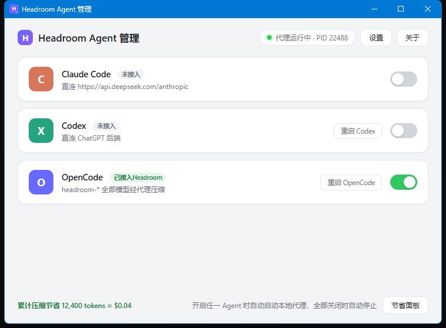

# HeadroomSwitch (English)

A Windows desktop manager for [Headroom](https://github.com/headroomlabs-ai/headroom) — scans locally installed AI coding agents and toggles Headroom context-compression per agent with one click. Turning a switch off automatically restores the original configuration.

> Not affiliated with headroomlabs-ai. This is an independent community tool that drives the open-source [`headroom`](https://github.com/headroomlabs-ai/headroom) CLI.



[中文文档](README.md)

## Features

- **Auto scan** — detects Claude Code / Codex / OpenCode on launch (CLI and desktop editions)
- **One-click toggle** — ON = route through the Headroom proxy (compressed); OFF = **automatically restore** the original config (with backup)
- **Zero-touch proxy** — starts the local proxy when any switch is on, stops it when all are off; auto-restores after reboot
- **In-app restart** — "Restart Codex / Restart OpenCode" buttons apply config changes instantly
- **Full model mirroring** (OpenCode) — mirrors every provider/model as `headroom-*` variants with per-request upstream routing headers; compression works on whichever model you pick
- **Savings widget** — live lifetime tokens (and USD estimate) saved by compression, plus a one-click link to the Headroom dashboard
- **Tray icon** — closing the window minimizes to tray; left-click to reopen, right-click to quit
- **Safe restore** — every config edit is backed up and precisely reverted

## How it works

| Agent | Switch ON | Switch OFF |
|---|---|---|
| **Claude Code** | `ANTHROPIC_BASE_URL` in `settings.json` points at the local proxy (original upstream remembered) | Original upstream restored |
| **Codex** | `openai_base_url` written to `config.toml` (applies to desktop + CLI) | Key removed |
| **OpenCode** | Injects `headroom-*` mirror providers with an `x-headroom-base-url` per-request routing header | All mirror providers removed |

The proxy runs as an independent background process. Requests are compressed before forwarding (SmartCrusher / CodeCompressor / CacheAligner); originals stay in a local cache and are retrievable on demand (Headroom CCR).

## Install

### Prerequisites

1. Windows 10/11
2. The [Headroom CLI](https://github.com/headroomlabs-ai/headroom):
   ```bash
   uv tool install "headroom-ai[all]"
   # or
   pip install "headroom-ai[all]"
   ```

### Option A: download a build

Grab `HeadroomSwitch.exe` from [Releases](../../releases).

### Option B: run from source

```bash
pip install -r requirements.txt
python app.py
```

### Build the EXE yourself

```bash
build.bat
```

Output: `dist/HeadroomSwitch.exe`. CI builds are also produced by GitHub Actions on every `v*` tag.

## Configuration

Open **Settings** in the top-right corner. Persisted at `~/.headroom-switcher/config.json`:

| Key | Default | Description |
|---|---|---|
| `port` | `8787` | Local Headroom proxy port (change only when all switches are off) |
| `network_proxy` | `"auto"` | Proxy used to reach model upstreams: `auto` = follow the Windows system proxy / `direct` / `http://host:port` |
| `headroom_path` | `""` | Optional override of the headroom CLI path |

## FAQ

**An agent can't connect after enabling?**
The proxy must be running (green status pill). The tool starts it automatically, but if the machine rebooted or the proxy was killed manually, open the tool once or toggle the switch.

**Claude Code change not taking effect?**
The CLI reads its config at session start — exit and relaunch `claude`.

**OpenCode model list unchanged?**
Restart the OpenCode app (use the "Restart OpenCode" button) and pick a `xxx via Headroom` model.

**macOS / Linux?**
Windows only for now. The core is plain Python + path handling — PRs for cross-platform support (proxy detection, `open`/`xdg-open` launching) are welcome.

## Acknowledgements

- [Headroom](https://github.com/headroomlabs-ai/headroom) — the engine this tool manages (Apache-2.0)
- [cc-switch](https://github.com/farion1231/cc-switch) — UI inspiration

## License

[MIT](LICENSE)
